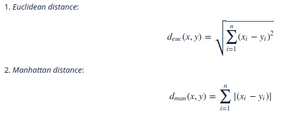

# Final assignment -- Data analysis of the Human data
Created on 10.12.2017  
@author: Xiaodong Li  
Email: xiaodaong.li@helsinki.fi  

## Abstract  

Linear regression, logistic regression, linear discriminant analysis were performed on the `Life.Exp` variable from the `human` dataset in order to find out the main relevant variables that related to the expected human life time. Distance measurements and K-means methods were also used to classify the whole dataset. Similar results were got from these methods. `Edu.Exp` has the most positive relationship with `Life.Exp`. Long time of education experience usually relates to long expected human life. `GNI` and `Parli.F` also have strong positive relationship with `Life.Exp`. The linear regression method also revealed that `Mat.Mor` has strong negative relationship with `Life.Exp`. 

## Data discirption  
The `human` dataset originates from the United Nations Development Programme. The data describes the Human Development Index (HDI) and Gross National Income (GNI) situation in different countries together with the education, labour and health experiences. The goal of the dataset is to show that the people and the their capabilities should be the ultimate criteria for assessing the development of a country, not economic growth alone.  
In this work we would like to show which is the most relevant variable with human life time. Is ecnomics the most relevant one? Or does labour time has a reletionship with life time? What is the role of education in expanding human life?

## Methods used for data analysis 

### 1. Visualizations with ggpairs and corrplot 

From the `GGally` library we could access the function `ggpairs()` which gives the relationships between the variables graphically and make it possible for us to visualize all of the relationships neatly in a single plot.  
From the corrplot package, we could use the `corrplot()` function to look at the correaltions between all the variables in a visual way. In addition, `corrplot()` is good at details, including choosing color, text labels, color labels, layout, etc.  

### 2. Multiple regression
We can use `lm()` to fit a linear model. The output of `lm()` is a linear model object, which can be saved for later use. When there are more than one explanatory variables in the linear model, it is called multiple regression. In R, it is easy to include more than one explanatory variables in the linear model. This is done by simply defining more explanatory variables with the formula argument of `lm()`.   
The generic funtion `summary()` can be used to print out a summary of the model. In the outputs, 

* The `Std. Error` is the standard deviation of the sampling distribution of the estimate of the coefficient under the standard regression assumptions.  

* The `t values` are the estimates divided by their standard errors. It is an estimation of how extreme the value you see is, relative to the standard error.  

* `Pr.` is the `p-value` for the hypothesis for which the `t value` is the test statistic. It tell you the probability of a test statistic at least as unusual as the one you obtained, if the null hypothesis were true (the null hypothesis is usually 'no effect', unless something else is specified). So, if the `p-value` is very low, then there is a higher probability that you're see data that is counter-indicative of zero effect.  

* `Residual standard error` represents the standard deviation of the residuals. It's a measure of how close the fit is to the points.  

* `The Multiple R-squared` is the proportion of the variance in the data that's explained by the model. The more variables you add, the large this will be. The `Adjusted R-squared` reduces that to account for the number of variables in the model.  
* The `F-statistic` on the last line is telling you whether the regression as a whole is performing 'better than random',in other words, it tells whether your model fits better than you'd expect if all your predictors had no relationship with the response.  
* `The p-value` in the last row is the p-value for that test, essentially comparing the full model you fitted with an intercept-only model.  

### 3. Graphical model validation

R makes it easy to graphically explore the validity of the model. If we give a linear model object as the first argument to the `plot()` function, the function automatically assumes that you want diagnostic plots and will produce them. In the plot function we can use the argument `which` to choose which plots we want. In this report, `Residuals vs Fitted values`, `Normal QQ-plot` and `Residuals vs Leverage` will be used to validate the linear model.  

* The `Residuals vs Fitted values` plot is a scatter plot of residuals on the y axis and fitted values (estimated responses) on the x axis. The plot is used to detect non-linearity, unequal error variances, and outliers.  

* The `quantile-quantile plot (Q-Q plot)` is a better graphical method for revealing non-normality. In general, a Q-Q plot compares the quantiles of the data with the quantiles of a reference distribution; if the data are from a distribution of the same type (up to scaling and location), a reasonably straight line should be observed.

* The `Residuals vs Leverage` plot helps us find influential cases. We watch out for outlying values at the upper right corner or at the lower right corner. Those spots are the places where cases can be influential against a regression line. Look for cases outside of a dashed line, Cook’s distance. When cases are outside of the Cook’s distance (meaning they have high Cook’s distance scores), the cases are influential to the regression results. The regression results will be altered if we exclude those cases.  

### 4. Logistic regression

Logistic regression is a regression model where the dependent variable is categorical. In R, the logistic regression model can be done by using `glm()` function. Similarly to the linear regression model, the results of the model could be shown be using `summary()` function.  

### 5. Box plot

Box plots are an excellent way of displaying and comparing distributions. The box visualizes the percentiles of the 25th, 50th and 75th of the data, while the whiskers show the typical range and the outliers of a variable.  

### 6. Odds ratios

The ratio of expected "success" to "failures" is called the odds: p/(1-p). Odds are an alternative way of expressing probabilities. Higher odds corresponds to a higher probability of success when OR>1. Odds higher than 1 means that X is positively associated with "success". If OR < 1, lower odds corresponds to the higher probability of success. The computational target variable in the logistic regression model is the log of odds, so applying exponent function to the modelled values gives the odds. 

### 7. Linear discriminant analysis

Linear discriminant analysis is a classification (and dimension reduction) method. It finds the (linear) combination of the variables that separate the target variable classes. The target can be binary or multiclass variable. 

### 8. Visualization LDA results with biplot.

LDA can be visualized with a biplot. A biplot is an enhanced scatter plot that uses both points and vectors to represent structure. A biplot uses points to represent the scores of the observation on the principal components and it uses vectors to represent the coefficients of the variables on the principal components. 
`Points`: Points that are close together correspond to observations that have similar scores on the components displayed in the plot. To the extent that these components fit the data well, the points also correspond to observations that have similar values on the variables.  
`Vectors`: A vector point in the direction which is most like the variable represented by the vector. This is the direction which has the highest squared multiple correlation with the principal components. The lenght of the vector is proportional to the squared multiple correlation between the fitted values for the variable and the variable itself.  

* The angle between arrows representing the original features can be interpreted as the correlations between the features. Small angle=high positive correlation.

* The angle between a feature and a principal component axis can be interpreted as the correlation between the two. Small angle = high positive correlation. 

* The lenght of the arrows are proportional to the standard deviation of the features. 

### 9. Distance measurements  

Similarity and dissimilarity of objects can be measured with distance measurements. There are many different measures for different types of data. In this report, we are going to preform `Euclidean distance` and `Manhattan distance` for the data.  
The calculations of thest two distances are:  
  

### 10. K-means  

K-means is maybe the most used and known clustering method. It is an unsupervised method, that assighs observations to groups or clusters based on similarity of the objects.   
One way to determine the number of clusters is to look at how the total of within cluster sum of squares (WCSS) behaves when the number of cluster changes. When you plot the number of clusters and the total WCSS, the optimal number of clusters is when the total WCSS drops radically.  
The method of calculating K-means:
1. Choose the number of clusters and initial centroids.
2. Calculate distances between centroids and data points.
3. For all the data points: assign data point to clusters based on which centroid is closest.
4. Update centroids: within each cluster, calculate new centroid.
5. Update cluster: calculate distances between data points and updated centroids. If some other centroid is closer than the cluster centroid where the data point belongs, the data point changes cluster.
Continue updating steps until the centroids or the clusters do not change.  


## Data analysis

### step 0: Import packages  
The R packages `GGally`,`corrplot` were used during the data analysis.  
```{r}
library(GGally)
library(corrplot)
library(ggplot2)
library(MASS)
library(tidyr)
```
### Step 1: Read and explore data  
The `human` data was created by the script in the following link: https://github.com/XiaodongAAA/IODS-final/blob/master/Data/creat_human.R   
You could check the data here, https://github.com/XiaodongAAA/IODS-final/blob/master/Data/human.txt.  

```{r}
human = read.table('/home/xiaodong/IODS_course/IODS-final/Data/human.txt',sep='\t',header = TRUE)
```
The structure of the `human` data is:  
```{r}
str(human)
```
The dimensions of the `human` data is:  
```{r}
dim(human)
```  
The `human` data has 8 variables. With each variable, 155 observations were presented.
The meaning of each variable is shown below:  

* `Edu2.FM`: The ratio of Female and Male populations with secondary education  

* `Labo.FM`: The ratio of labour force participation of females and males  

* `Life.Exp`: Life expectancy at birth  

* `Edu.Exp`: Expected years of education  

* `GNI`: Gross national income per capita  

* `Mat.Mor`: Maternal mortality ratio  

* `Ado.Birth`: Adolescent birth rate  

* `Parli.F`: Percent Representation in Parliament

### Step 2: Graphical overview of the data  
Visualize the `human` data with ggpairs().
```{r}
ggpairs(human)
```
Visualize the `human` data with correlation plots.  
```{r}
cor_matrix=cor(human)
corrplot(cor_matrix,type='lower')
```  
  
The scatter plots and correlation plots between all the variables shown above give information about the relationships and distributions of all the data. We need to pay attention to several 'big' points in the correlation plot.  

* `Mat.Mor` has strong negative relationship with both `Life.Exp` and `Edu.Exp`.  

* `Ado.Birth` has strong negative relationship with both `Life.Exp` and `Edu.Exp`.

* `Edu.Exp` has strong positive relationship with `Life.Exp`.

* `Ado.Birth` has strong positive relationship with `Mat.Mor`.

The relationships between two variables are shown 'graphically' in scatter plots created by ggpairs() and we can see clearly the strong positive/negative relationships between these variables.  

### Step 3: Multiple regression 
From the above data exploration, we can see that the variable `Life.Exp` has both strong positive and negative relationships with several other variables. We could do mutiple regression on `Life.Exp` to visualize the relationships of `Life.Exp` with other variables.  
First we do the multiple regression of `Life.Exp` to all the other variables. The summary of the model is shown below. 

```{r}
life_model=lm(Life.Exp~Edu2.FM + Labo.FM + Edu.Exp + GNI + Mat.Mor + Ado.Birth + Parli.F, data=human)
summary(life_model)
```  

The meanings of the variables in the output of the model summary are shown in the `Methods` part. From the summary, we can conclude that, `Edu.Exp`,`GNI` and `Mat.Mor` have strong relationship with `Life.Exp`. According to the results, we do the multiple model again just with these three strongly related variables. The results of the model are shown below.  

```{r}
life_model=lm(Life.Exp~Edu.Exp + GNI + Mat.Mor, data=human)
summary(life_model)
```

According to the summary results, the relatioship between these varialbes are $Life.Exp = 64.30 + 0.7084*Edu.Exp + 8.300e-5*GNI - 2.313e-2*Mat.Mor$. This result is partly in line with the correlation plot shown in the last step. In the correlaiton plot, we can read that `Life.Exp` has relatively strong negative relationship with `Ado.Birth` too. However, it didn't show clear relationship between these two variables from the linear model results. `GNI` seems not to be a very important factor for `Life.Exp` from the correlation plot, however, it turns out that `GNI` has strong relatioship with `Life.Exp` in the linear model.  

### Step 4: Model validation  
The linear model got in the last step was validated by using `Residuals vs Fitted values`, `Normal QQ-plot` and `Residuals vs Leverage` methods. The results are shown below.  

```{r}
plot(life_model, which = c(1,2,5))
```   

The meanings of all three plots are shown in the method part. 

* The `Residuals vs Fitted` values plot examines if the errors have constant variance. The graph shows a reasonable constant variance without any pattern around 0.  

* The `Normal QQ-polt` checks if the errors are normally distributed. We see from the graph a very good linear model fit, indicating a normally distributed error set.  

* The `Residuals vs Leverage` plot helps us find influential cases. From the figure we can see that Qatar is on the 0.5 Cook's distance line. So we should not exclude Qatar in the model. The other two countries that are important for the model are Sierra leone and Kuwalt.  

### Step 5: Logistic regression

In order to perform logistic regression, we introduce a new logical column called `Long.life` which is true when the expected life is more than 75.  

```{r}
human = read.table('/home/xiaodong/IODS_course/IODS-final/Data/human_long_life.txt',sep='\t',header = TRUE)
```

In this step we are going to explore the `Life.Exp` variable by using logistic regression method. First we use `glm()` to fit a logistic regression model with `Long.life` as the target variable and all the other variables (except for `Life.Exp` as the predictors. The results are shown below.  
```{r}
long_model=glm(Long.life~Edu2.FM + Labo.FM + Edu.Exp + GNI + Mat.Mor + Ado.Birth + Parli.F, data=human)
summary(long_model)
```  

By performing logistic regression and get rid of the most unrelative varibale at each time, finally we get the three most relative variables. 
```{r}
long_model=glm(Long.life~Edu.Exp+GNI+Parli.F,data=human)
summary(long_model)
```  
From the results of the model, we could see that `Edu.Exp` and `GNI` are the two variables that have strongest relationship with `Long.life`. In addition, the variable `Parli.F` also has relationship with `Long.life`, but the influence is not as strong as the first two.  
The equation of the variable can be written as $Long.life=1/(1+exp(-(6.756e-2*Edu.Exp+8.772e-6*GNI+5.200e-3*Parli.F-0.7664)))$  

The distributions of the variables could be displsyed graphically by using bos plots. The distributions of the three variable with `Long.life` are shown below.  
```{r}
box_edu=ggplot(human,aes(x=Long.life,y=Edu.Exp))+geom_boxplot(); box_edu
```
```{r}
box_gni=ggplot(human,aes(x=Long.life,y=GNI))+geom_boxplot(); box_gni
```
```{r}
box_par=ggplot(human,aes(x=Long.life,y=Parli.F))+geom_boxplot(); box_par
```  

From the box plots we could see clearly that the more years education and more GNI could result in Long expected life. The high percent representation in parliament could also result in long expected life, however, the relationship is not as clear as education and GNI.  

The computational target variable in the logistic regression model is the log of odds, it follows that applying the exponent function to the modelled values gives the odds. For this reason, the exponents of the coefficinets of a logistic regression model can be interpret as odds ratios between a unit change in the corresponding explanatory variable.  
The odds ratios and coresponding confidence intervals for the coefficients are shown below.  
```{r}
OR=coef(long_model) %>% exp
CI=confint(long_model) %>% exp
cbind(OR,CI)
```

### Step 6: Linear discriminant analysis  
For the later use, we will need to scale the data. The function `scale()` gives the scaled data by subtracting the column means from the corresponding columns and dividing the difference with standard devidation. 

```{r}
human = read.table('/home/xiaodong/IODS_course/IODS-final/Data/human.txt',sep='\t',header = TRUE)
human_scaled=scale(human)
human_scaled=as.data.frame(human_scaled)
```

In order for the LDA analysis, we need to creat a categorical variable. In the last step, we created `Long.life` which is defined as the Life.Exp more than 75. In this step, we are going to creat `Qua.life` by using `quantile()` function to get the short, medium_short, medium_long and long life based on the quantile cutting.  

```{r}
bins=quantile(human_scaled$Life.Exp)
Qua.life=cut(human_scaled$Life.Exp, breaks=bins, include.lowest = TRUE, label=c('short','med_short','med_long','long'))
table(Qua.life)
human_scaled=dplyr::select(human_scaled,-Life.Exp)
human_scaled=data.frame(human_scaled,Qua.life)
```  

Fit a linear discriminant analysis with the function lda(). The function takes a formula as a first argument. Here we use the created `Qua.life` as a target variable and all the other variables as predictors. The lda results are shown below. 
```{r}
lda.fit=lda(Qua.life~.,data=human_scaled)
lda.fit
```

LDA can be visualized with a biplot. We use the biplot arrow function showed in [this](https://stackoverflow.com/questions/17232251/how-can-i-plot-a-biplot-for-lda-in-r) Stack Overflow message thread as the plotted arrow function.  
```{r}
lda.arrows <- function(x, myscale = 1, arrow_heads = 0.1, color = "black", tex = 0.75, choices = c(1,2)){
  heads <- coef(x)
  arrows(x0 = 0, y0 = 0, 
         x1 = myscale * heads[,choices[1]], 
         y1 = myscale * heads[,choices[2]], col=color, length = arrow_heads)
  text(myscale * heads[,choices], labels = row.names(heads), 
       cex = tex, col=color, pos=3)
}
plot(lda.fit, dimen=2, col=as.numeric(human_scaled$Qua.life), pch=as.numeric(human_scaled$Qua.life))
lda.arrows(lda.fit,myscale = 3)
```

From the last step, we got the conclusion that, long expected life is related to `Edu.Exp`, `GNI` and `Parli.F`. The biplot clearly shows the same conclusion. From the angle between the arrows and the axis, we could tell that Edu.Exp has the most positive relationship with long half life. This is also in accordance with the previous conclusion.  

### Step 7. Distance measurements and K-means  

Here we perform *Euclidean distance* and *Manhattan distance* on `human` data to have a look at the similarities of the data.  
The result of *Euclidean distance* is shown below.

```{r}
human = read.table('/home/xiaodong/IODS_course/IODS-final/Data/human.txt',sep='\t',header = TRUE)
human_scaled=scale(human)
dist_eu=dist(human_scaled,method='euclidean')
summary(dist_eu)
```

The result of *Manhattan distance* is shown below.

```{r}
dist_man=dist(human_scaled,method='manhattan')
summary(dist_man)
```

In order to find the optimal number of clusters, we can plot the number of clusters and the total WCSS. The optimal number of clusters is when the total WCSS drops radically.  

```{r}
set.seed(123)
k_max=10
twcss=sapply(1:k_max, function(k){kmeans(human_scaled,k)$tot.withinss})
qplot(x=1:k_max,y=twcss,geom='line')
```  

According to the figure shown above, the most radically drop of the line happens when the K value is 2. So the optimal number of clusters is 2.  

Now we can perform the K-means for the scaled `human` data with two clusters.  
```{r}
km=kmeans(human_scaled,centers=2)
pairs(human_scaled,col=km$cluster)
```  

From the figure we can see that, for most of the variables, the k-means method could classify the results quite well, expecially the `Life.Exp` variable that we care most of. In the clustering figure, the `Life.Exp` is divided into two clusters, corresponding to short and long life as we did in the previous steps.  
The method of calculating K-means is shown in the method part. K-means is a quick and simple method to cluster analysis. It aims to partition n observations into k clusters in which each observation belongs to the cluster with the nearest mean, serving as a prototype of the cluster.  
However, the number of clusters k is very unpredictable. In this example, we used a simple way to find the optimal k value. But we must remember that, an inappropriate choice of k may yield poor results.  
The choice of the initial cluster center has a great impact on the clustering result. Once the initial value is not chosen well, it may not be able to get a valid clustering result. The K-means method randomly assigns the initial cluster centers and this is a major issue of K-means algorithms. We used the function `set.seed()` to deal with the problem, but usually we need to choose the initial centers quite well.   

## Conclusion  
In this report, we performed linear regression, logistic regression, linear discriminant analysis on the `Life.Exp` variable from the `human` dataset in order to find out the main relevant variables that related to the expected human life time. In addition, distance meansurements and K-means methods were used to classify the whole dataset. Similar results were got from these methods. The results revealed that `Edu.Exp` is the most relevant variable with `Life.Exp`. Long time of education experience usually relates to long expected human life. `GNI` and `Parli.F` also have strong positive relationship with `Life.Exp`. The linear regression method also revealed that `Mat.Mor` has strong negative relationship with `Life.Exp`.  
In order to extend extend the human life time, education is most practical method. The ecnomics and people's pursuing of political life can also affect the life time. At the same time, we need to care more about the babies' mortality, expecailly in the poor area. 


